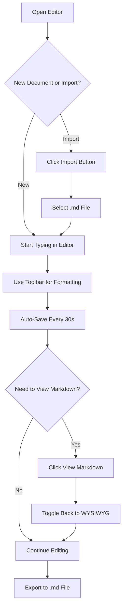
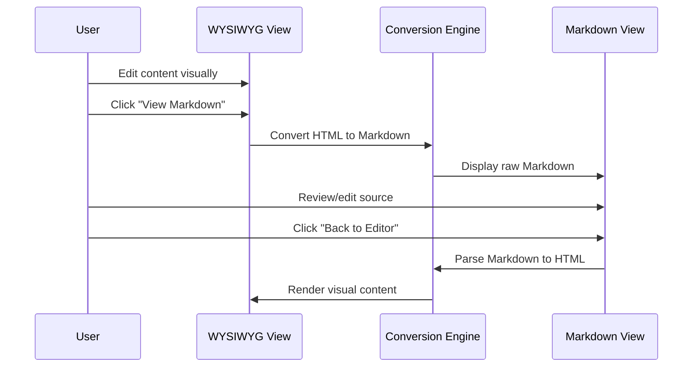
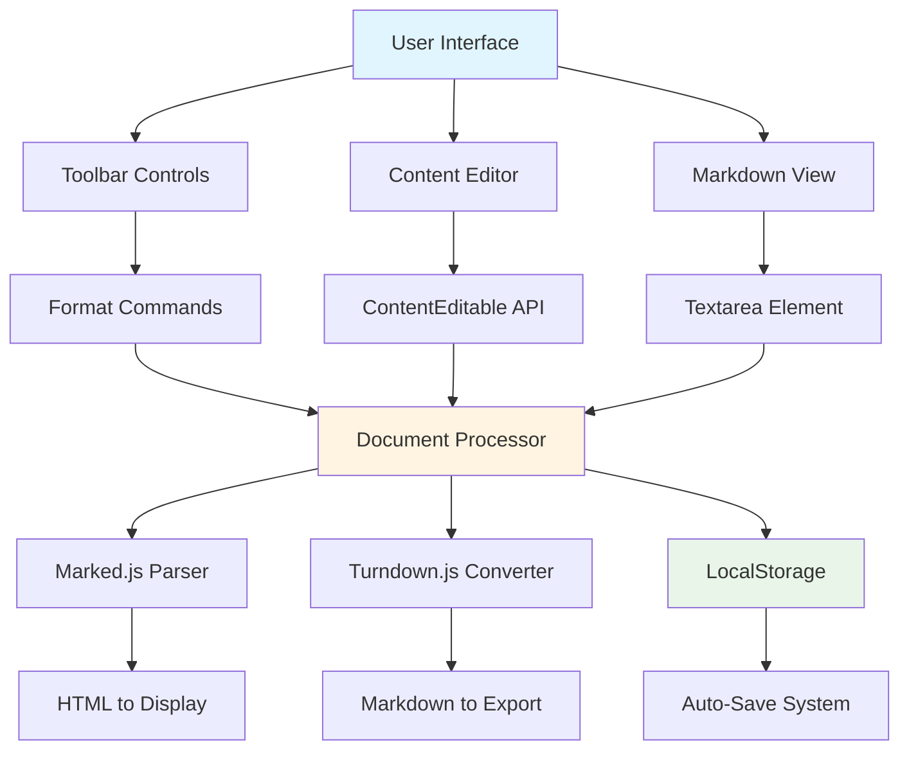

# xsukax Markdown WYSIWYG Editor

A powerful, privacy-focused, client-side Markdown WYSIWYG editor that runs entirely in your browser with no server dependencies.

[](https://xsukax.github.io/xsukax-Markdown-WYSIWYG-Editor)
[](https://www.gnu.org/licenses/gpl-3.0)

## Project Overview

The xsukax Markdown WYSIWYG Editor is a feature-rich, browser-based Markdown editor that provides real-time visual editing capabilities while maintaining full Markdown compatibility. Built as a single-file application, it offers a seamless editing experience with the ability to toggle between WYSIWYG and raw Markdown views, making it ideal for content creators, developers, and documentation writers who need a reliable, portable Markdown editing solution.

The editor combines the intuitive interface of traditional word processors with the power and flexibility of Markdown syntax, supporting both standard and extended Markdown features including tables, task lists, footnotes, and advanced formatting options.

## Security and Privacy Benefits

This application prioritizes user privacy and data security through its architectural design:

- **Zero Server Communication**: The editor operates entirely client-side with no data transmitted to external servers, ensuring complete privacy of your content
- **Local Data Storage**: All content is stored exclusively in your browser's localStorage, giving you full control over your data
- **No Tracking or Analytics**: The application contains no tracking scripts, cookies, or analytics tools that monitor your usage or behavior
- **Offline Capability**: Functions completely offline after initial load, protecting your work even without internet connectivity
- **No External Dependencies at Runtime**: While CDN resources are loaded initially, all processing occurs locally with no ongoing external requests
- **Open Source Transparency**: Full source code visibility allows security auditing and verification of privacy claims
- **Single-File Architecture**: The entire application exists in one HTML file, making it easy to audit, verify, and trust

These privacy-first design principles ensure that your documents, drafts, and sensitive content remain exclusively under your control.

## Features and Advantages

### Core Capabilities
- **Dual-Mode Editing**: Seamlessly switch between WYSIWYG visual editing and raw Markdown source
- **Rich Formatting Toolbar**: Comprehensive controls for text styling, headings, lists, links, images, and code
- **Extended Markdown Support**: Beyond basic syntax, includes task lists, tables, footnotes, definition lists, subscript, superscript, and highlighting
- **Auto-Save Functionality**: Automatically saves your work every 30 seconds to prevent data loss
- **Real-Time Statistics**: Live word count, character count, and line count tracking
- **Import/Export**: Easy import of existing Markdown files and export to standard `.md` format

### Advanced Features
- **Keyboard Shortcuts**: Productivity-enhancing shortcuts for common formatting operations (Ctrl/Cmd+B, I, U, S)
- **Code Block Support**: Insert and edit syntax-highlighted code blocks with proper formatting
- **Table Creation**: Built-in table generator with header row support
- **Task List Management**: Create interactive checklists with checkbox support
- **Image and Link Insertion**: Modal dialogs for adding images and hyperlinks with descriptive text
- **Blockquote Formatting**: Quick conversion of text to blockquote style
- **Horizontal Rules**: One-click insertion of section dividers

### User Experience
- **Responsive Design**: Fully responsive interface that adapts to different screen sizes
- **Clean, Modern UI**: Built with Tailwind CSS for a professional appearance
- **Inline Help**: Built-in Markdown syntax cheatsheet accessible from the toolbar
- **Visual Feedback**: Toast notifications for important actions and status updates
- **Smart Paste Handling**: Paste content as plain text to maintain formatting consistency

### Technical Advantages
- **No Installation Required**: Single HTML file that runs directly in any modern browser
- **Cross-Platform**: Works on Windows, macOS, Linux, and mobile devices
- **Lightweight**: Minimal resource footprint with fast load times
- **Framework-Free Core**: Built with vanilla JavaScript for maximum compatibility and minimal dependencies
- **Standards-Compliant**: Produces clean, standard Markdown output compatible with all Markdown processors

## Installation Instructions

### Option 1: Direct Browser Use
1. Download the `index.html` file from this repository
2. Open the file directly in any modern web browser (Chrome, Firefox, Safari, Edge)
3. Start editing immediately—no additional setup required

### Option 2: Local Web Server (Recommended for Development)
1. Clone the repository:
   ```bash
   git clone https://github.com/xsukax/xsukax-Markdown-WYSIWYG-Editor.git
   cd xsukax-Markdown-WYSIWYG-Editor
   ```

2. Serve the file using any local web server:
   
   **Using Python 3:**
   ```bash
   python -m http.server 8000
   ```
   
   **Using Node.js (with http-server):**
   ```bash
   npx http-server -p 8000
   ```
   
   **Using PHP:**
   ```bash
   php -S localhost:8000
   ```

3. Open your browser and navigate to `http://localhost:8000`

### Option 3: Online Demo
Visit the live demo at [https://xsukax.github.io/xsukax-Markdown-WYSIWYG-Editor](https://xsukax.github.io/xsukax-Markdown-WYSIWYG-Editor) to use the editor immediately without any download.

### System Requirements
- Modern web browser with JavaScript enabled
- Support for localStorage API
- No internet connection required after initial load

## Usage Guide

### Getting Started



### Basic Operations

**Creating a New Document**
1. Click the "New" button in the header
2. Confirm if you have unsaved changes
3. Begin typing in the editor pane

**Formatting Text**
- **Bold**: Select text and click **B** or press Ctrl/Cmd+B
- **Italic**: Select text and click *I* or press Ctrl/Cmd+I
- **Underline**: Select text and click <u>U</u> or press Ctrl/Cmd+U
- **Strikethrough**: Select text and click the strikethrough button

**Adding Headings**
1. Place cursor on the line you want to convert
2. Click H1-H6 buttons for different heading levels
3. The text automatically formats with appropriate styling

**Inserting Links**
1. Select the text you want to link (optional)
2. Click the 🔗 link button
3. Enter the URL and link text in the modal
4. Click "Insert"

**Adding Images**
1. Place cursor where you want the image
2. Click the 🖼️ image button
3. Enter the image URL and description
4. Click "Insert"

**Creating Lists**
- **Bullet List**: Click "• List" button or type `- ` at line start
- **Numbered List**: Click "1. List" button or type `1. ` at line start
- **Task List**: Click "☑ Task" button to insert checkboxes

**Working with Tables**
1. Click the table button (⊞)
2. A 3x3 table template is inserted
3. Click on cells to edit content
4. Add rows by typing after the last row

### Advanced Features

**Switching Between Views**



**Code Blocks**
1. Click the `{ }` button
2. A code block template appears
3. Type or paste your code
4. The block maintains proper formatting

**Importing Files**
1. Click "Import" button
2. Select a `.md`, `.markdown`, or `.txt` file
3. The content loads into the editor automatically
4. Edit as needed

**Exporting Documents**
1. Click "Export" button
2. File downloads automatically as `document-[timestamp].md`
3. Compatible with all Markdown processors

**Manual Save**
- Press Ctrl/Cmd+S at any time
- Notification confirms save completion
- Content persists in browser localStorage

### Keyboard Shortcuts

| Shortcut | Action |
|----------|--------|
| Ctrl/Cmd + B | Bold |
| Ctrl/Cmd + I | Italic |
| Ctrl/Cmd + U | Underline |
| Ctrl/Cmd + S | Save manually |
| Tab | Insert 4 spaces |

### Application Architecture



### Tips and Best Practices

1. **Regular Exports**: While auto-save protects against browser issues, regularly export important documents
2. **Preview Your Work**: Toggle to Markdown view to verify syntax correctness
3. **Use Keyboard Shortcuts**: Improve productivity with Ctrl/Cmd combinations
4. **Check the Cheatsheet**: Click the "?" button for quick Markdown syntax reference
5. **Test Links and Images**: Verify URLs are correct before exporting
6. **Browser Compatibility**: Use modern browsers for best experience (Chrome 90+, Firefox 88+, Safari 14+, Edge 90+)

## Browser Compatibility

| Browser | Minimum Version | Status |
|---------|----------------|---------|
| Chrome | 90+ | ✅ Fully Supported |
| Firefox | 88+ | ✅ Fully Supported |
| Safari | 14+ | ✅ Fully Supported |
| Edge | 90+ | ✅ Fully Supported |
| Opera | 76+ | ✅ Fully Supported |

## Technical Stack

- **Frontend**: HTML5, CSS3, Vanilla JavaScript
- **Styling**: Tailwind CSS 3.x (via CDN)
- **Markdown Parsing**: Marked.js 12.0.2
- **HTML to Markdown**: Turndown.js 7.1.2
- **Storage**: Browser localStorage API

## Limitations and Known Issues

- **Browser Storage Limits**: localStorage typically limited to 5-10MB depending on browser
- **No Cloud Sync**: Content stays on the device where it was created
- **Browser-Specific**: Data doesn't transfer between different browsers on the same device
- **Cache Clearing**: Clearing browser data will remove saved content

## Contributing

Contributions are welcome! Please feel free to submit pull requests or open issues for bugs, feature requests, or improvements.

## License

This project is licensed under the GNU General Public License v3.0.

## Acknowledgments

- [Marked.js](https://marked.js.org/) - Fast Markdown parser
- [Turndown](https://github.com/mixmark-io/turndown) - HTML to Markdown converter
- [Tailwind CSS](https://tailwindcss.com/) - Utility-first CSS framework

## Support

For issues, questions, or suggestions, please open an issue on the [GitHub repository](https://github.com/xsukax/xsukax-Markdown-WYSIWYG-Editor/issues).

---

**Live Demo**: [https://xsukax.github.io/xsukax-Markdown-WYSIWYG-Editor](https://xsukax.github.io/xsukax-Markdown-WYSIWYG-Editor)

**Repository**: [https://github.com/xsukax/xsukax-Markdown-WYSIWYG-Editor](https://github.com/xsukax/xsukax-Markdown-WYSIWYG-Editor)
